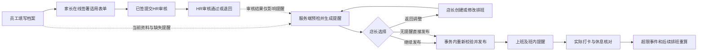

# 移动端未成年用工合规设计：NSW / QLD

设计日期：2026-09-20。交付范围：设计方案；未实施业务代码、数据库迁移或生产配置。

适用场景：Hot Bargain 普通零售门店员工。以适用 General Retail Industry Award 2020（MA000004）的普通门店岗位为设计起点，实际雇主、岗位、enterprise agreement / award 必须由 HR 确认。仓储、配送、演出、促销拍摄、学徒、实习、家庭企业和法定特殊许可需另行分类，不自动继承普通零售结论。

## 1. 设计结论

在移动端“个人信息”新增“未成年用工合规”入口，并在排班、发布、调班和实际考勤环节共用服务端规则。未满 18 岁是档案入口条件；具体限制由工作日期的年龄、教育状态、工作地州、岗位和适用法律决定。

- QLD 的 school-aged child 不能等同于所有未满 18 岁员工。
- NSW 普通零售不能直接套用 QLD 的 4 / 8 / 12 / 38 小时规则，也不能套用 NSW 演艺、模特等特殊行业规则。
- 家长同意、两名紧急联系人、其他工作都纳入档案；分别标注“州法要求”“Award 要求”“公司政策”。
- NSW 与 QLD 统一采用产品/公司必填规则：家长/监护人必须提供一个有效联系电话（手机或固定电话）和有效邮箱；这不声称两州法律统一强制提供 email。允许先保存不完整草稿、继续填写其他资料及预览；发起签署、完成签字和提交 HR 审核前必须补齐。
- 学校日历和公共假日日历分开；周末、学校假期、上学周分别计算。
- 保留计划与实际工时，检查跨门店及已申报的其他雇主工时。资料缺失显示“待核实”，不能显示“已合规”。
- “排班路程”同时覆盖排班流程和上下班通勤：通勤作为安全约束独立判断，不直接混入法定工时或工资。
- 所有未成年合规结果都是提醒，不作为排班发布门禁。即使存在法定风险、资料缺失、家长签字未完成、审核退回或其他工作未知，店长仍可继续发布；发布状态和合规状态分别记录。权限不足、请求格式错误、版本冲突等原有技术校验仍可失败，但不属于未成年合规规则。

## 2. 已核实的州别规则

### 2.1 QLD：普通零售的学龄儿童规则

QLD 官方把 school-aged child 定义为未满 16 岁且依法必须在学校注册就读的儿童；未满 16 岁但已完成义务教育（如 Year 10）或依法不再需要注册的，不按这个身份处理。仍应核验教育/培训参与义务及一般儿童保护义务。[QLD 术语定义](https://www.business.qld.gov.au/running-business/employing/hiring-recruitment/employing-children/terms)

满 16 岁或完成 Year 10 后还可能处于 compulsory participation phase，直到满足规定的完成条件或满 17 岁；这不等于已经没有教育安排限制。作为参与路径的每周至少 25 小时有薪工作也不是未成年人统一工时上限。[QLD 教育和培训参与说明](https://dtet.qld.gov.au/training/training-careers/courses/espd)

| 校验项 | 一般规则 | 产品处理 |
| --- | --- | --- |
| 最低工作年龄 | 普通零售通常为 13 岁；11–12 岁有限配送例外不适用于普通收银理货 | 显示高风险提醒，要求 HR 核验法定许可或岗位分类；不阻断发布 |
| 上学日 | 最多 4 小时 | 合计当日工作，不只是当前班次 |
| 非上学日 | 最多 8 小时 | 周末是否有实际学校安排仍需判断 |
| 上学周 | 最多 12 小时 | 周日开始，周内任一天需上学即属于上学周 |
| 非上学周 | 最多 38 小时 | 该周完全没有需上学日才采用该额度 |
| 学校时间 | 不得在要求出席学校的时间工作 | 与个人学校/教育安排逐段比对 |
| 夜间 | 学龄儿童不得在 22:00–06:00 工作 | 显示高风险提醒；不能通过加班工资或家长签字解除 |
| 班间休息 | 同一雇主的班次之间至少 12 小时 | 跨门店仍按实际法律雇主聚合，冲突时提醒并保留继续发布选项 |
| 班次数及餐休 | 默认每天一班；连续工作 4 小时后需至少一小时休息；相关条款明确允许 industrial instrument 另有规定 | 分别核验班次数及休息的适用条款，不能仅选中 Award 就整体关闭提醒 |
| 收银监督 | 涉及收付款的学龄儿童需适当监督，附近有成人且定期联系 | 校验实际有覆盖时段的成年监督人 |

规则依据：[Business Queensland 普通行业工作限制](https://www.business.qld.gov.au/running-business/employing/hiring-recruitment/employing-children/restrictions)。休息和每日班次数存在明示的 industrial instrument 例外，不能简单对所有规则“取较严数字”。同一雇主 12 小时班间休息也不能因为 Retail Award 存在 10 小时协议选项就直接放宽。

QLD 学龄儿童开始工作前须取得适用的家长同意表或有效特殊情况证书。家长同意不构成超出法定限制的授权。学校时间变化需更新表格，官方说明要求家长在变化后 14 日内提供更新；一旦系统已知时间变更，应立即按新安排校验，不把 14 日解释成允许冲突工作的宽限期。[QLD 雇主及家长义务](https://www.business.qld.gov.au/running-business/employing/hiring-recruitment/employing-children/obligations)

QLD 官方同意表 CE1 包含家长/监护人、另一名 nominated contact、学校时间、雇主以及其他工作安排。因此本方案的“两名联系人”默认是“家长/监护人 + 另一名不同的备用联系人”，不是“家长之外再强制两人”。同意表绑定具体雇主，换法律雇主需要重新检查。[官方 CE1 表格](https://www.oir.qld.gov.au/system/files/2023-02/6457-parents-consent-form-for-school-aged-or-young-child.pdf)

外部工作必须参与 QLD 相关时段工时合计。每日一班默认限制也要检查其他雇主的同日工作，不能套用“同一雇主 12 小时班间休息”的范围；正常班内餐休不拆成第二班。相关 industrial instrument 是否替代默认班次数要求需定位具体条款，不能自动推定。额外跨雇主疲劳检查标为公司安全政策。[QLD Child Employment Regulation 2016，第 9–10 条](https://www.legislation.qld.gov.au/view/whole/html/inforce/current/sl-2016-0137)

QLD 所有未满 18 岁员工还需保留家长及家长指定的备用负责人的资料，包含已不属于学龄儿童的 16–17 岁员工；这项记录义务与是否必须提供学龄儿童同意书分别判断。主管机关的 work limitation notice 可以限制本来允许的工作，必须录入有效期、雇主和限制范围并优先校验。[QLD Child Employment Guide](https://www.oir.qld.gov.au/system/files/2023-02/child-employment-guide.pdf)、[工作限制通知](https://www.business.qld.gov.au/running-business/employing/hiring-recruitment/employing-children/restrictions)

### 2.2 NSW：普通零售规则

NSW 官方说明普通工作没有统一最低法定年龄，普通零售不属于 OCG 模特、表演等特殊儿童雇佣制度的通常适用范围；普通零售儿童员工的工时受到义务教育和出勤要求约束。因此本方案不配置所谓“NSW 法定学期每周 12 小时”，也不把特殊行业的 21:00 截止时间用于普通零售。[NSW Government：Starting work](https://www.nsw.gov.au/employment/rights-responsibilities/starting-work)

NSW 要求完成 Year 10；完成后至 17 岁期间，需要继续学校、获批准的教育/培训、有薪工作或适用组合。官方所述有薪工作平均每周 25 小时是该教育参与路径的要求，不是所有未成年人的工作上限。满 17 岁或完成 Year 10 也不能让系统忽略员工仍然存在的实际学校安排。[NSW Education：School leaving age](https://education.nsw.gov.au/schooling/parents-and-carers/pathways-after-school/school-leaving-age)

本次核对的官方普通零售资料没有确立“所有 NSW 未成年人入职必须家长签字、必须两名紧急联系人”的普遍规则。产品采用两项公司要求，满足用户的安全管理目标；特定 Award 协议所需家长批准另行处理，不用一份入职签字统包。

建议 NSW 默认公司政策：未满 18 岁收集监护人同意、两名联系人、教育安排及其他工作申报；上学时段禁止排班，晚班核验安全回家安排。需要设置更低周工时或最晚结束时间时，由 HR 明确政策及生效日期，不虚构法定数值。

## 3. Fair Work / Retail Award 的叠加

适用 Award/enterprise agreement 是独立输入，不能由门店名字或“未成年”自动认定。年龄限制遵循工作地州要求。[Fair Work：Minimum working age](https://www.fairwork.gov.au/find-help-for/young-workers-and-students/minimum-working-age)

普通 Retail Award 场景需要纳入：

- Casual 一般最低每日 engagement 为 3 小时。1.5 小时例外需要同时满足全日制中学生、需上学当日 15:00–18:30 内工作、本人同意并取得家长/监护人批准，以及因经营要求或员工不能到岗而无法安排更长班次。
- 该短班例外不能自动套到周末、学校假期或 part-time；part-time 一般最低每日 engagement 为连续 3 小时。
- 班内有带薪休息及餐休规则；连续工作不能超过 5 小时而没有餐休。休息要在排班中记录。
- 一般班间休息 12 小时，Award 允许协议调整到 10 小时，但不得解除另行适用的州法限制；实际违反还需处理对应工资后果。

条款定位：[Retail Award 10.9、11.2–11.3、16](https://awards.fairwork.gov.au/MA000004.html)。不在本设计复制完整工资和休息表，实施时使用经 HR 确认、按生效日期版本化的 Award 配置。

联邦 NES 的每周普通时数及合理额外工时规则不能取代 QLD 学龄儿童的硬上限；part-time/casual 也不能一律视为“38 小时内都可自由排”。[Fair Work：Maximum weekly hours](https://www.fairwork.gov.au/tools-and-resources/fact-sheets/minimum-workplace-entitlements/maximum-weekly-hours)

工资计费时数与实际工作时数分开。例如实际工作 2 小时而存在最低 3 小时付款义务，不能把付款补足的 1 小时当作儿童实际工作；也不能借此自动认定该短班安排符合 Award。年龄薪资规则按出生日期和工资规则版本处理，满 18 岁只结束未成年档案强制维护，不代表所有 junior pay 规则结束。[Fair Work：Junior pay rates](https://www.fairwork.gov.au/pay-and-wages/minimum-wages/junior-pay-rates)

## 4. 移动端个人信息

### 4.1 信息架构和视觉

保留现有 Overview / Basic / Sensitive 内容。在个人信息概览增加“未成年用工合规”一行状态入口，点击进入独立子页；生日缺失显示“请补充出生日期以确认适用要求”。

沿用现有蓝色主题、系统字体、16px 间距和表单控件。首屏显示合规状态、提醒原因和下一步；下面分组编辑。标题 20–22、组标题 16、字段/解释 14–16，避免装饰图、复杂动效和满屏警报卡片。颜色同时配合文字和图标，不靠红绿色表达唯一信息。按钮点击区域至少 44×44，支持动态字体、屏幕阅读器、中英文本和 320/390 宽度。所有提醒弹层提供“返回调整”和“继续发布”，继续发布为正常可点击操作；可填写备注但不假称因此取得法律豁免。

```text
个人信息 › 未成年用工合规

待完成：家长签字                  [继续填写]
15 岁 · QLD · 学龄儿童

示例合规周（含上学日）  周日 — 周六
本公司计划及已工作 6h + 外部申报 3h
预计 9h / 本周上限 12h，剩余最多 3h
外部工作已确认（示例）

年龄与教育状态                   已完成 >
学校时间与假期                   已核实 >
家长/监护人同意                  待签署 >
紧急联系人                       2 / 2 >
其他工作及本周安排               已申报 >
通勤与可上班时间                 已完成 >

规则依据与历史记录                        >
```

日期和数字是界面示例，不代表本周实际学校日历。NSW 不显示虚构的 12 小时法定额度；显示适用 Award/公司限额及学校冲突检查结果。“剩余最多”只反映周累计，日上限、班间休息和最低班长仍需检查。

### 4.2 字段与责任

| 分组 | 字段 | 校验及维护责任 |
| --- | --- | --- |
| 身份 | 复用出生日期，自动计算班次当日年龄；证据类型、核验人、核验时间 | 年龄有疑点须核验；避免重复收集整份身份证件 |
| 雇佣上下文 | 法律雇主、门店、工作地州/时区、岗位、employment type、Award/协议及版本 | HR 维护；不能让员工随意切州解除限制 |
| 教育状态 | 在校/家庭教育/远程/培训/完成义务教育/其他；Year 10 完成日期；学校/提供者及联系人；参与路径和证据 | 员工申报、HR 核验；“不在校”不能自动等同合法离校 |
| 学校安排 | 学校所在州、时区、日历版本、每周需出席时段、学期/假期、pupil-free day、考试/特殊安排 | 实际个人学校安排优先；学校所在地可以与工作州不同 |
| 家长/监护人 | 姓名、关系、资格声明、有效联系电话（手机或固定电话，必填）、有效邮箱（必填）、所需地址；同意范围、文件、签署日期、状态 | NSW 与 QLD 均为产品/公司必填规则，不声称两州法律统一强制 email；QLD CE1 按官方字段；特殊监护安排由授权 HR 处理 |
| 紧急联系人 | 主联系人和备用联系人各自姓名、关系、电话、优先顺序；QLD 所需地址、家长指定人/时间/证据 | 默认家长为主联系人，另一不同人士为备用；QLD 备用负责人由家长指定并留证，不能仅由员工随意填写；联系人知悉其用途 |
| 其他工作 | 无/有/尚未确认；雇主、工作地、时区、岗位；每天具体起止、休息、预计/实际及声明时间 | 不默认“无”；无其他工作也要明确确认；不要求无关薪水信息 |
| 通勤 | 放学至门店预计分钟、下班回家分钟、交通方式、接送人、最晚可用交通时间/本人最晚可工作时间 | 安全/可用性约束，非自动工资扣减项 |
| 审核 | 草稿、待签字、待审核、有效、变更待复核、已撤销、已失效、无需适用 | 档案版本、证据、适用政策、审核轨迹可追溯 |
| 个别法定条件 | 特殊情况证书、work limitation notice；发出机关、文件、有效期间、适用雇主/岗位/时段及限制 | HR 核验并结构化录入；到期、变更或撤销触发重新评估 |

两个联系人指两个不同的人。备用联系人不能替代家长/监护人的必填电话和邮箱。家长电话与邮箱缺失或格式无效时允许保存不完整草稿，但不能完成签字或提交 HR 审核；所有相关排班提醒仍可继续发布。相同号码提示复核，不能因家庭共用号码简单禁止提交。没有可联系家长、独立生活或特殊保护情形提供私密 HR 路径；QLD 需要法定授权时必须核验有效证书，不能由店长勾选豁免。

### 4.3 签字与审核

第一期在移动端在线填写 QLD 官方 CE1 的完整字段和声明，家长/监护人补齐有效联系电话和邮箱后，通过独立签署入口完成真实线上签字；签字完成后进入“已签待提交”，由员工提交 HR 审核。系统按 CE1 原版字段映射生成不可变的、可下载的 CE1 PDF，并保存独立签署证据；这是企业流程设计，不宣称电子签署已获得政府特别认可，也不以下载打印上传作为一期依赖。NSW 普通零售没有对应的通用官方 CE1，使用明确标注为“NSW 公司未成年员工同意书”的企业表单，不能冒充 NSW 官方表格。

线上方案须有独立家长访问入口、身份/关系确认、完整同意内容、主动签署动作、签署时间、文件版本及完整性校验、接收认可和撤回/更新记录。签署服务上线前仍需由 HR/法务核验电子签名的身份、签署意图和接收认可证据是否满足企业留档要求。签字只授权在合法范围内工作，不授权放弃休息、工资或超时保护。

两类表单均采用：草稿 → 待家长签字 → 已签待提交 → 待 HR 审核 → 审核通过 / 退回修改。已签内容发生任何影响同意范围、学校安排、联系人、法律雇主或工作条件的改动，必须生成新版本并重新签字；旧版本、签署证据、PDF 快照和退回意见保留，不覆盖历史。入职同意、特殊短班批准、通勤安排、其他需单独批准的 Award 协议分别存储。每学期提醒核对是公司流程，不声称法律统一规定每学期重新签字。

在线签署未完成、HR 尚未审核或审核退回只生成风险提醒；不阻断排班发布。排班发布状态与合规审核状态分离，发布成功不改变“待审核/退回/资料缺失”状态。

生日从 Basic 被修改时也触发重新评估，不能通过普通资料保存绕过核验。满 16/17/18 岁、Year 10 完成、学校改变、法规生效日期均重新计算受影响未来班次；历史规则与证据快照保持原状。

入职核验还需记录符合年龄的安全培训完成情况。QLD 学龄儿童所在工作场所需显眼展示、便于其阅读的 child employment guide；手机中提供链接不能自动代替现场展示。生病或受伤而无法工作时，保留联系家长或备用负责人的事件记录，并确保工作中可合理联系他们。[QLD Regulation 第 12、14–17 条](https://www.legislation.qld.gov.au/view/whole/html/inforce/current/sl-2016-0137)

### 4.4 页面设计稿交付

所有相关页面的可浏览 HTML、总览图和逐页 PNG 设计稿位于 [`docs/design/minor-employment-compliance-ui-20260920/`](./minor-employment-compliance-ui-20260920/)。员工端入口为 [`index.html`](./minor-employment-compliance-ui-20260920/index.html)，HR 双端总入口为 [`hr-review.html`](./minor-employment-compliance-ui-20260920/hr-review.html)，并附 [`README.md`](./minor-employment-compliance-ui-20260920/README.md)。这些是产品设计稿；本地导航、签字和继续发布可演示，未连接真实签署服务或业务 API，不代表线上功能已实现。

App 设计由原 21 页扩展为 26 页，新增/补充 HR 相关页面为：HR 审核入口、HR 审核列表、QLD 审核详情、文件版本历史、退回修改、审核结果、NSW 审核详情、只读原件，共 8 页。HR 页面同时覆盖通过和退回结果态、家长电话/邮箱必填的公司规则、原件只读；状态并发处理要求见下节。联系人页、表单预览、家长签署、已签提交审核、NSW 同意书及 HR 审核详情均展示或核对家长电话/邮箱必填；联系人页显示格式校验、草稿不完整状态及签署前补齐提醒。设计稿中的“继续发布”均保留已发布状态，并展示未解决风险。

### 4.5 HR Web / App 双端审核设计

员工本人仍从 App“个人信息”填写和签署。未成年用工审核尚未上线，不能与现有敏感资料审核入口混同；本方案拟新增审核类型，复用权限和审计模式但保持独立状态。

| 端 | 入口与页面 | 设计职责 |
| --- | --- | --- |
| Web | `系统管理 → 员工个人信息维护 → 待审核 → 未成年用工合规`（拟新增类型） | `web/index.html?page=queue/detail/return/result/history/nsw`，共 6 个页面状态：审核列表、QLD 详情、退回修改、审核结果、文件历史、NSW 详情 |
| App | `工作台 → 人员管理 → 资料审核 → 未成年用工合规`（拟新增类型） | 26 个页面中的 HR 页面为第 19–26 页：审核列表、QLD 详情、文件历史、HR 入口、退回修改、审核结果、NSW 详情、只读原件 |

HR 审核列表显示员工、工作州、表单类型、档案版本、当前状态、提交及更新时间和风险摘要；App 将详细签署时间与证据收纳在审核详情中。详情页区分 QLD CE1 与 NSW 公司同意书：NSW 只检查 NSW 适用的教育安排、公司政策和 HR 配置，不套用 QLD 的 4/8/12/38 小时规则。两端显示相同的状态枚举：草稿、待家长签字、已签待提交、待审核、审核通过、退回修改、已撤回、已失效。

HR 可以查看原件和签署审计，但不能直接修改已签署表单的内容、家长签名、电话、邮箱、学校安排或联系人。需要更正时只能退回指定字段；退回操作必须填写退回意见，员工修改后生成新版本并重新签字，旧版本保持只读。HR 的必填退回意见只约束审核处理，不影响排班发布；审核通过或退回均不改变已经发布的排班状态。

并发处理采用版本号和状态条件更新：列表进入详情时显示当前版本；另一名 HR 已审核、退回或员工已生成新版本时，提交结果必须提示版本已变化并要求刷新，不能覆盖新版本。Web 与 App 读取同一状态和版本，任一端完成通过/退回后，另一端刷新后立即显示相同结果。原件下载、查看签署证据和退回记录写入审计；电话、邮箱、地址和签名在列表和推送中最小化展示。

“审核通过”表示 HR 完成资料审核，不表示法定工时自动通过；“退回修改”表示资料或证据需要更新，不表示排班被禁止。所有未成年合规提醒仍允许店长继续发布，并保留发布审计。

## 5. 学校假期和周末的判定

一个日期至少保留四个独立维度：

1. 星期属性：普通工作日 / 周六 / 周日，用于排班显示及适用工资规则。
2. 个人教育安排：是否需出席、具体时段、学校假期/学生无需到校日及证据。
3. 工作地公共假日：使用现有门店公共假日模块；不替代学校假期。
4. 法规统计周：QLD 学龄儿童按周日到周六，独立于界面周一到周日的展示和工资周期。

示例：

| 场景 | QLD 学龄儿童日限额 | 周限额和说明 |
| --- | --- | --- |
| 学期内普通上学日 | 4h | 有上学日的周为 12h |
| 学期内周六，不需到校 | 8h | 仍计入该上学周 12h |
| 周日，不需到校，下周一需上学 | 8h | 周日已是新合规周，计入新周 12h |
| 学校假期完整周，周日到周六都无需上学 | 8h | 38h，仍检查其他限制 |
| 周中开始/结束假期，但本周还有上学日 | 非上学日 8h、上学日 4h | 整周仍为 12h |
| pupil-free day 或公共假日，无个人出席要求 | 8h | 不自动把整周变为非上学周 |
| 缺少本人学校日历 | 不能宣称确认日限额 | 标“待核实”，不能自动放宽到假期 38h |

上述为 QLD 规则的产品计算示例，依据第 2.1 节官方限制。NSW 同样区分这些日期，但不因此套入 QLD 数字。

州立学校日历只是模板。NSW 有 Eastern / Western Division 区别，边界地区及非政府学校可能不同；日历维护要支持具体学校覆盖，并记录学校/家长确认。[NSW 2026 学校日历](https://education.nsw.gov.au/schooling/calendars/2026)

QLD CE1 已明确要求申报与标准学校安排不同的假期、pupil-free days 及远程/家庭教育安排，不能用“周一至周五 09:00–15:00”硬编码。[CE1 教育安排部分](https://www.oir.qld.gov.au/system/files/2023-02/6457-parents-consent-form-for-school-aged-or-young-child.pdf)

## 6. 排班全流程和提醒



| 环节 | 员工/店长看到什么 | 系统行为 |
| --- | --- | --- |
| 入职/资料更新 | 缺少的具体材料、适用要求 | 可以保存草稿；显示待核实状态和提醒，不阻断排班发布 |
| 新建、复制、批量排班 | 本班、本日、合规周额度及冲突原因 | 服务端检查全部相关门店和外部工作；发现问题生成提醒，预览不等于已合规 |
| 修改已发布班次 | 变更前后工时及新冲突 | 重算本周、相邻周、前后班间休息；更新合规状态并保留发布状态 |
| 整周发布 | 按员工分组的高风险、待处理、通过状态 | 风险弹层提供“返回调整 / 继续发布”；继续发布记录操作人、时间、规则结果和可选备注 |
| 换班/临时延时 | 双方资格、学校冲突及剩余额度 | 当前缺少专门换班入口；后续实现必须接同一服务，不能只交换员工ID |
| 开班前 | 上学冲突、同意变更、外部工时更新等最新状态 | 复核授权资格并通知店长安排替代；通知方式在实施中配置 |
| 班内 | 接近实际日/周上限、休息到期 | 第一期由服务端根据进行中考勤计算，例如提前30分钟提醒属公司配置；通知当班负责人并要求确认交接，超限未处理继续升级 |
| 签退/补卡/审批 | 实际工作与计划的差异及历史异常 | 真实记录照常保存，超限不能通过拒收打卡、自动截断或自动扣餐休隐藏 |

实际已经工作的时间，即使触发法定风险，也要准确记录并进入工资核对。排班提醒、继续发布和接收事实证据是三个独立动作；系统不通过截断工时或拒收打卡制造“已合规”状态。

提醒文案例：

- **高风险提醒 · QLD 法定周工时**：本周（周日—周六）其他门店 6h、外部申报 3h、当前班次 4h，预计合计 13h，超过本周 12h 上限。建议减少 1h 或选择其他员工；店长仍可选择“继续发布”。
- **高风险提醒 · 学校冲突**：该员工本日需上学至 15:10，班次 14:30 开始。请返回调整，也可继续发布；备注选填。
- **提醒 · Award 最低班长**：周六 2h casual 班次不满足上学日短班例外。请重排到至少 3h，或由 HR 核验实际另有适用协议；继续发布不代表获得 Award 或法律豁免。
- **排班冲突 · 通勤安排**：放学 15:10，预计到店 15:45，当前班次 15:30 开始。请调整开始时间或核实具体替代交通；这是可用性/公司安全约束，不标为州法工时违规。
- **待核实 · 外部工作**：员工声明有其他工作，但本周时间尚未确认；剩余可排工时无法确认。

颜色不等于法律分类。每项结果同时带来源类别、规则名称、计算范围、实际值、阈值、具体修正操作和依据链接。NSW 公司政策触发必须明确写“公司政策”，不能写“违反 NSW 法律”。风险弹层的“继续发布”始终可用；若操作人填写备注，备注只作为审计记录，不代表法律豁免或 HR 审核通过。

## 7. 计算与规则服务

建议新增有限职责的 `MinorEmploymentComplianceService`，首期使用类型明确的 NSW/QLD 规则实现及带生效日期的配置，不引入通用规则脚本平台。

输入：员工/档案版本、班次日期年龄、法律雇主、工作门店州及 IANA 时区、学校时区和个人日历、岗位、Award/协议、同意/证书、有效工作限制通知、实际工时、已发布及本次拟发布排班、外部工作、休息、监督人及公司政策。

输出：`status`（pass / warning / incomplete / review）、`findings[]`、日/周计算摘要、规则版本、所有输入版本与 `evaluationId`。单条 finding 有 `ruleId`、`sourceType`、`sourceUrl`、`severity`、`windowStart/end`、实际/阈值分钟、原因及解决方法。法律结论由服务端输出，不由客户端拼阈值。`status` 只表示合规评估状态，不控制发布状态；发布 API 记录 `published` 与 `complianceStatus` 两套结果。

计算原则：

1. 出生日期用 DateOnly；以班次发生日而非今天计算适用年龄。工作州来自核实的门店信息，不用家庭地址或手机时区。
2. NSW 使用 `Australia/Sydney`，QLD 使用 `Australia/Brisbane` 等实际门店时区；跨州边界按真实地点核验，禁止固定 UTC+10。学校时区与门店时区分开。
3. 每条工作发生记录只计一次：已结束班次用实际，未来班次用计划，进行中用已发生时间加预计剩余；修改时替换原版本，不把新旧班次相加。缺打卡不能默认为零。
4. 本公司所有相关门店汇总，取消班次排除，批量发布同时计入整批。其他工作分别保存计划和实际、自报人和更新时间，并显示数据可信度。
5. 日/周工时用分钟累计再显示；不先四舍五入，不按两周平均抵消 QLD 的单周超限。窗口定义写入规则，工资周不能代替法定周。
6. 工作时数、带薪时数、最低付款时数、班次跨度、工作间隔分别计算。带薪短休不能作为任意扣减项；餐休只有真实发生且符合适用定义才处理。实际漏休保留异常。
7. 未成年人跨州/多雇主情况按每条规则各自范围检查；外部工作也用于疲劳提醒，不把全部外部小时机械套入本雇主的所有 Award 加班计算。
8. 预检后发布在事务内重读并重新计算，按员工及相关时间窗保持数据一致。两位店长同时发布时，后一次评估包含先前已提交班次，确保最新累计提醒不漏报；即使累计超限仍可发布，记录发布时的实际风险结果，不因该提醒进入重试或审批循环。
9. 关键资料、日历、法源或适用范围未知，返回 incomplete/review，不能显示“已合规”。可以保存草稿，也不能以“家长同意”把提醒改成通过；店长仍可继续发布。
10. 法定证书及许可只在已核验的雇主、时间、岗位和明确条款范围内生效；公司审批不能生成法定豁免。缺证或待核验时显示高风险提醒。
11. 有效工作限制通知按其明确范围生成最高级提醒；一般规则通过不代表可覆盖个别限制。适用条件冲突时交 HR 核验，普通店长可以继续发布但必须留下操作审计，不把继续发布标为合规。

对通勤：只收集必要时间和方式；不默认接地图服务、不跟踪 GPS。学校放学→到店、下班→最后交通/接送以及跨店移动分别提示。雇主要求的工作中跨店移动需按实际适用工时/工资规则单独分类，不能一概当作无薪上下班通勤。通勤和第二份工作是疲劳风险的重要输入。[SafeWork NSW 雇主疲劳管理责任](https://www.safework.nsw.gov.au/hazards-a-z/fatigue/employer-responsibilities)

## 8. 与现有仓库的衔接

以下基于 2026-09-20 当前本地工作树只读检查；不代表线上已部署状态。Codebase Memory 项目索引可用；本轮只写设计，不改业务逻辑。

| 现有位置 | 复用或扩展方向 |
| --- | --- |
| `apps/mobile/app/(shell)/employee-profile.tsx` | 保持 Overview / Basic / Sensitive；增加合规入口和状态摘要 |
| `apps/mobile/src/modules/employee-profile/types.ts`、`api-contract.ts` | 复用 birthday、employmentType；增加独立合规接口契约，不把资料塞进地址字段 |
| `services/backend/BlazorApp.Api/Services/EmployeeProfileService.cs`、`EmployeeProfilesController.cs` | 复用身份/门店授权、revision 与审核模式；合规审核独立于银行/身份证件申请 |
| `services/backend/BlazorApp.Shared/Models/HBweb/Attendance/AttendanceSchedule.cs` | 已有 Draft / Active / Cancelled、日期、时间、门店、员工；需补适用的休息计划和监督信息 |
| `services/backend/BlazorApp.Api/Services/React/AttendanceReactService.cs` | `CreateScheduleAsync`、`UpdateScheduleAsync`、`PublishWeekAsync` 接共同校验；目前时间及同店重叠校验不足以覆盖合规 |
| `apps/mobile/src/components/attendance/ScheduleManagementCard.tsx` | 编辑预检及发布前汇总 |
| `apps/mobile/src/components/attendance/WeeklyScheduleTable.tsx` | 个人排班显示学校日/假期/周末及合规周摘要 |
| `apps/mobile/src/modules/attendance/api.ts` | 复用可上班时间、排班、发布、考勤；学校日历与现有公共假日 API 分开 |
| 门店 `TimeZoneId` 与现有 postcode/address 推导 | 时区能力可复用；合规州需显式核实，推断不明确不能自动通过 |

拟新增数据职责（表/实体名称可在实施时按仓库规范调整）：

- `EmployeeMinorCompliance`：员工、教育状态、审核与版本；身份事实与生效期间。
- `EmployeeEmergencyContact`、`EmployeeGuardianConsent`：联系人及不可变的同意文件版本；法定表单内容快照。
- `EmployeeEducationCalendar`：学校提供者、时区、日历区间/例外和核验来源。
- `EmployeeExternalWorkDeclaration`：外部雇主及具体工作区间，区分计划/实际和确认状态。
- `ComplianceEvaluation`：发布或审核时的结果、所用规则、证据及数据版本。实际工时原始记录仍在考勤模块。

建议接口职责：员工读取/保存本人合规草稿、发起 QLD CE1 或 NSW 公司同意书签署；家长完成签署后进入“已签待提交”，由员工提交 HR 审核；HR 审核；排班预检及风险确认。创建/修改/发布 API 内部也必须调用校验服务，不能依赖前端先调用预检。接口具备幂等键/版本冲突处理；附件读取独立鉴权。发布 API 不因未成年合规结果返回错误；继续发布时写入发布审计和可选备注。

当前个人信息、DTO、服务、权限及相关测试已有未提交改动。实施需在这些修改的最新状态上协调，仅修改本任务内容；本设计不覆盖现有工作。

## 9. 权限、隐私和保存

员工可维护本人声明、查阅本人材料；家长只访问绑定的同意材料；店长看到可否排班、原因、必要安全联系人和工作时间，不默认看到学校证明/监护文件全文；HR 可核验完整材料。紧急联系人查看和文件下载留访问日志。

公司政策和法定义务分别版本化。家长同意不等于持续查看员工所有资料的权限。普通排班列表、锁屏推送和日志不显示身份证件、家长电话、家庭地址或签名。敏感附件使用私有存储及短时授权读取，不复用公开下载链接。

Fair Work 的工时工资记录需保存 7 年；QLD 儿童记录须在员工最后一次为该雇主工作之日后保存 2 年，并满足当地雇主营业地点保存要求，不能从表单创建之日开始倒计时。按记录类别设置保存期限，涉及工资/工时的按 7 年要求保留；不要声称所有家长签名和联系人都被同一条法律强制保存 7 年。需保存更久的证据由 HR 定义依据、期限及删除流程。[Fair Work 记录要求](https://www.fairwork.gov.au/pay-and-wages/paying-wages/record-keeping)、[QLD 指南记录章节](https://www.oir.qld.gov.au/system/files/2023-02/child-employment-guide.pdf)

设计应支持英文检查导出、完整历史及在 QLD 营业地点可提供的记录副本；不能仅因云端可下载就宣称满足当地保存要求。QLD 非学龄未满 18 岁员工的年龄证明留档要求也需纳入证据类型，实施前确认现有私有存储能满足实际记录义务。

## 10. 分期与验收

第一期形成完整安全闭环：个人档案、在线填写 QLD 官方 CE1 完整字段和声明、家长真实线上签字、可下载不可变 CE1 PDF、HR 审核、NSW 公司同意书、两名联系人、学校个人日历、其他工作申报、服务端创建/修改/发布提醒、跨门店合计、班内临界工时及休息提醒、实际考勤异常和审计。进行中提醒至少覆盖当班负责人的待办/通知与确认、超时升级；员工未开启手机通知不能让负责人失去提醒。所有风险均可继续发布，不能只上线一个“已阅读未成年规定”复选框并声称完成合规。

第二期改善操作：学校日历模板更新、外部班次快速确认、专门换班流程、更多通知渠道和管理报表。第一期仍需在实际上班、补卡及审批时核对事实；第二期提高操作便利性。独立家长电子签署不再是第二期内容，而是第一期必需流程；后续只增强签署方式和身份验证。

实施验收至少覆盖：

| 用例 | 预期 |
| --- | --- |
| QLD 15岁需上学，学校日拟工作4h01m | 显示高风险提醒，精确指出超1分钟；仍可继续发布并记录审计 |
| QLD 学期周六6h，本周另有4h公司+3h外部 | 日未超限但周13h，显示高风险提醒；仍可继续发布 |
| QLD 完整非上学周37h与38h边界 | 仍检查日限额、休息、监督等，不能仅周额度通过 |
| 周日班次、周中放假、pupil-free day | 按正确周窗口和个人出席安排计算 |
| 学校不在工作州；NSW夏令时与QLD交叉 | 日期与学校/门店时间正确，手机时区不影响结果 |
| QLD 15岁已完成Year10、16岁仍在校、NSW16岁完成Year10 | 分类重算，教育/培训安排仍检查，不统一套12h |
| NSW 普通零售14岁入职 | 不因虚构NSW最低16岁阻断；执行核验和公司政策 |
| 周六2h casual、上学日合条件1.5h casual、2h part-time | 分别按适用短班规则处理；不共享错误例外 |
| QLD 学龄儿童适用Retail Award的餐休安排 | 按明确instrument分支检查；不无条件叠加1h默认规则 |
| QLD 同日在外部雇主已工作，拟增加独立班次 | 检查默认每日一班及实际适用条款；不能因不是同一雇主直接放行 |
| QLD 16–17岁员工缺少家长指定备用联系人的证据 | 显示记录缺失，不误认为已非学龄便无需维护 |
| NSW/QLD 家长电话或邮箱缺失、无效，或只有备用联系人资料 | 允许保存不完整草稿；签字和提交 HR 前要求补齐；排班仅显示提醒，仍可继续发布 |
| Web / App HR 审核同一份资料 | 两端显示相同员工、版本和状态；一端通过或退回后另一端刷新可见相同结果 |
| HR 查看已签表单 | 原件和签署审计只读；不能改签署内容；需要更正时退回指定字段并要求必填意见 |
| HR 退回后员工修改 | 生成新版本并重新签字；旧版本仍可查看，排班提醒继续允许发布 |
| 两名 HR 或 Web/App 并发提交 | 版本冲突可见，不能覆盖新版本；刷新后按最新状态处理 |
| NSW HR 审核 | 只检查 NSW 教育安排、公司政策和已配置要求，不套用 QLD 4/8/12/38 小时规则 |
| 个别work limitation notice限制某时段/岗位 | 即使一般年龄及工时规则通过，也按有效通知显示最高级提醒；仍可继续发布，系统记录操作审计；备注选填 |
| 已知通勤赶不上班；声明替代接送后修改 | 原冲突显示提醒；修改后重新计算，继续发布不代表安全安排已核实 |
| 家长同意撤回/学校时间改变/跨法律雇主 | 重检未来班次；旧文件保留；不能仅沿用旧绿色状态 |
| 外部工作未知、漏打卡、资料过期 | 不按0计入，不显示已确认可用额度 |
| 两店长并发发布、修改同一班、批量复制 | 事务内合计，版本冲突可见，不超分配 |
| 实际延长工作或漏餐休 | 保留完整事实，生成事件及工资复核，不截断工时 |
| 进行中工作接近日/周上限或休息到期 | 提前提醒当班负责人，未处理升级；重算时不重复累计计划和实际 |
| 320/390宽、动态字体、中英文、屏幕阅读器 | 状态可理解、按钮可触达、长文本无横向溢出 |

实施前需要 HR 明确的业务配置：实际 Award/enterprise agreement 与雇主映射、NSW 公司工时/晚班政策、特殊教育及法定许可证据标准、电子签署启用方式和记录存储方案。这些属于落地配置，不影响本方案的总体设计。
